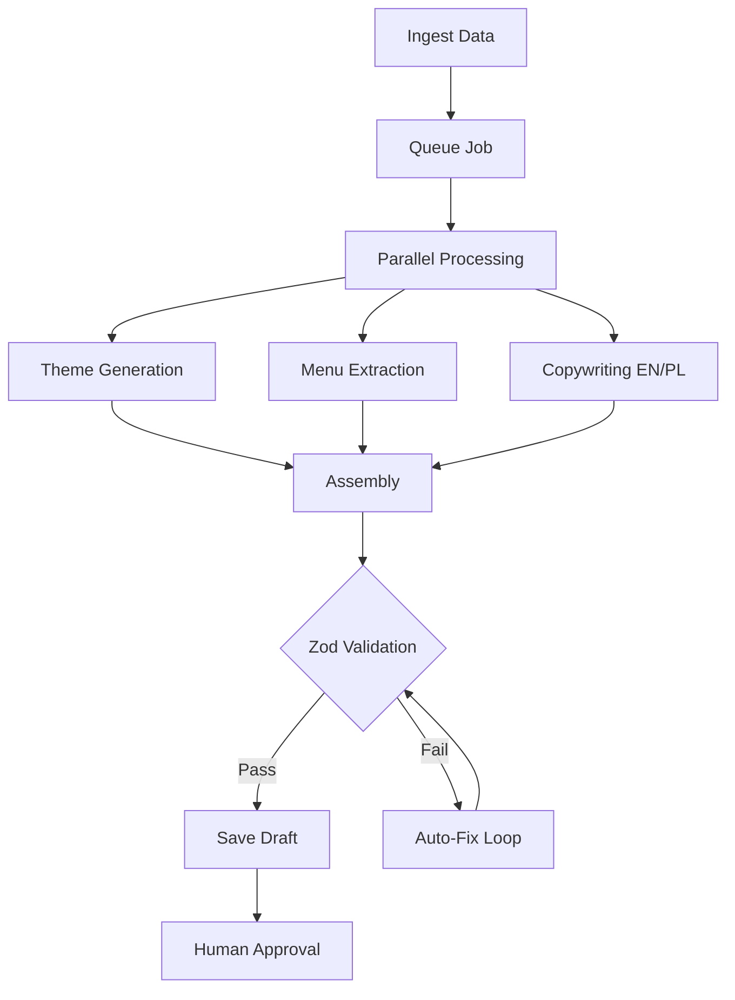

# AI Generation Pipeline Architecture

## 1. AI Generation Pipeline
- **Orchestrator**: Background worker (Inngest/QStash) executing state machine workflows.
- **Inputs**: URLs, PDFs, raw text, images (Screenshots, Instagram).
- **Processing**: Parallel task execution for extracting brand, menu, and SEO data.
- **Output**: Fully validated JSON `RestaurantConfig` matching Zod contracts.

## 2. Prompt Orchestration System
- **Framework**: LangChain/Vercel AI SDK wrapper.
- **Templates**: Version-controlled prompt templates with few-shot examples for Layout variants.
- **Role**: Standardized system prompts (e.g., `ROLE: Restaurant Website JSON Architect`).
- **Chain**: Sequential prompt execution (Extraction -> Brand Analysis -> Content Generation -> Assembly).

## 3. Config Generation Architecture
- **Step 1**: Structure definition generation (variant selection).
- **Step 2**: Global theme tokens generation.
- **Step 3**: Section-by-section JSON object generation (Hero, About, Menu, Gallery).
- **Step 4**: Consolidation into `RestaurantConfigSchema`.

## 4. Theme Generation Pipeline
- **Input**: Visual inspiration (screenshot, logo, mood keywords).
- **Processing**: Vision model extracts dominant hex codes, font style classifications (serif/sans), and border radius preferences.
- **Output**: Maps to `ThemeTokens` schema (colors, typography, radii, motion profiles).

## 5. Content Generation Flow
- **Copywriting Model**: High-context model (Claude 3 Opus / Gemini 1.5 Pro).
- **Languages**: Generates primary (English) and secondary (Polish) `LocalizedString` records natively in parallel.
- **Format**: Strictly conforms to Zod string lengths (e.g., `.max(200)`).

## 6. Brand Analysis Pipeline
- **Vision Extraction**: Processes provided screenshots/Instagram feeds.
- **Output Data**: Mood (Luxurious, Casual, Edgy), dominant colors, typography style, media quality score.
- **Usage**: Automatically maps to optimal `motionProfile` and UI `variant` types.

## 7. Restaurant Data Ingestion
```typescript
interface IngestionPayload {
  sourceType: "maps_url" | "instagram_url" | "website_url" | "pdf_menu" | "raw_text";
  data: string | File;
  tenantId: string;
}
```

## 8. Screenshot/Image Analysis Flow
- **Model**: Vision models (GPT-4o, Gemini 1.5 Pro Vision).
- **Action**: OCR for menu extraction, color palette extraction for themes, vibe analysis for variant selection.

## 9. Website Generation Workflow
1. **Trigger**: `api/generate` receives IngestionPayload.
2. **Job Queued**: Upstash QStash initiates job.
3. **Data Scrape**: Apify/Firecrawl extracts raw content.
4. **LLM Parse**: Unstructured data parsed into structured Zod fragments.
5. **Assembly**: Fragments combined into complete `RestaurantConfig`.
6. **Validation**: `RestaurantConfigSchema.parse()`.
7. **Commit**: Save to DB as `isDraft: true`.

## 10. AI Validation Pipeline
- **Pre-Validation**: LLM instructed with `json_schema` strict mode (where supported).
- **Post-Validation**: Zod schema parsing.
- **Fix Loop**: If Zod fails, error stack is piped back to LLM for auto-correction (max 3 retries).

## 11. Multi-Model Orchestration
- **Router**: OpenRouter or custom API gateway.
- **Vision Tasks**: GPT-4o / Claude 3.5 Sonnet.
- **Bulk Extraction**: Gemini 1.5 Pro (massive context window).
- **Fast Assembly/Fixes**: Claude 3 Haiku / GPT-4o-mini.

## 12. Queue/Job System
```typescript
// Background Job Definition
export const generateWebsiteJob = inngest.createFunction(
  { id: "generate-website", retries: 3 },
  { event: "ai/generate" },
  async ({ event, step }) => {
    const rawData = await step.run("extract-data", ...);
    const theme = await step.run("generate-theme", ...);
    const content = await step.run("generate-content", ...);
    const config = await step.run("assemble-config", ...);
    return await step.run("save-draft", ...);
  }
);
```

## 13. Automation Agents
- **SEO Agent**: Automatically updates meta descriptions when menu items change.
- **Media Agent**: Auto-tags and generates alt-text for uploaded images.
- **Menu Agent**: Parses seasonal PDF uploads into JSON menu structures.

## 14. Human Approval Workflow
- **State**: Generated JSON is stored with `status: 'PENDING_APPROVAL'`.
- **UI**: Visual Page Builder (`iframe` preview) allows human review.
- **Action**: Admin clicks "Approve & Publish" -> updates `activeConfigId` -> invalidates Edge cache.

## 15. Regeneration Strategy
- **Granular Targeting**: Admin highlights specific section (e.g., "Hero").
- **Action**: AI regenerates only the `HeroData` fragment, merging into existing global config.

## 16. AI-Safe Schema Validation
```typescript
try {
  const finalJson = JSON.parse(llmOutput);
  const safeConfig = RestaurantConfigSchema.parse(finalJson);
  await db.configRevision.create({ data: { configData: safeConfig } });
} catch (error) {
  if (error instanceof z.ZodError) {
    await queueAutoFixJob(llmOutput, error.issues);
  }
}
```

## 17. Cost Optimization Architecture
- **Caching**: LLM responses cached by prompt hash (Redis) for identical regeneration requests.
- **Model Routing**: Cheap models (GPT-4o-mini) for syntax fixing; expensive models (Opus) only for creative copywriting.

## 18. Caching Strategy
- **Prompt Cache**: Redis layer hashing system prompt + input data.
- **Media Cache**: Scraped images stored in S3 temporarily during generation.

## 19. Retry/Fallback Strategy
- **Network Failures**: Exponential backoff via queue system.
- **Parsing Failures**: Max 3 LLM auto-correction attempts.
- **Final Fallback**: Returns partial valid JSON + flags missing sections for manual CMS completion.

## 20. Tenant Generation Flow

