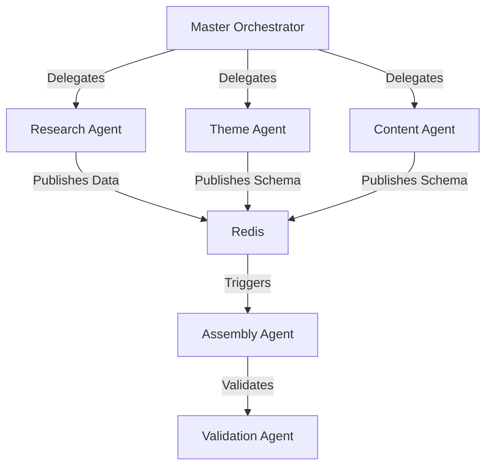

# Autonomous Agent & Orchestration Architecture

## 1. Agent Architecture Overview
- **Orchestrator**: Master control agent handling task delegation.
- **Workers**: Specialized node.js background processes executing specific agent roles.
- **Communication**: Redis Pub/Sub & BullMQ event streams.
- **State**: Persisted in PostgreSQL (Supabase).

## 2. Automation Worker Architecture
- **Environment**: Serverless (Vercel Functions) or persistent containers (Docker/AWS ECS) based on task duration.
- **Queueing**: BullMQ (Redis-backed) for reliable distributed job execution.

## 3. Multi-Agent Orchestration


## 4. Queue-Based Execution System
```typescript
import { Queue, Worker } from 'bullmq';

export const agentQueue = new Queue('autonomous-agents', { connection: redis });

const worker = new Worker('autonomous-agents', async job => {
  switch(job.name) {
    case 'analyze-instagram': return await runInstagramAgent(job.data);
    case 'generate-theme': return await runThemeAgent(job.data);
  }
}, { connection: redis, concurrency: 10 });
```

## 5. Task Scheduling Architecture
- **Cron**: BullMQ repeatable jobs (`pattern: '0 0 * * *'`) for nightly SEO re-generation or CMS sync checks.
- **Delayed**: Retries scheduled exponentially (`backoff: { type: 'exponential', delay: 1000 }`).

## 6. AI Orchestration Layer
- **Router**: OpenRouter proxy routing to optimal model based on cost/speed.
- **Context Manager**: Injects scraped data + global Zod schemas into prompt.
- **Execution**: LangChain / Vercel AI SDK wrappers.

## 7. Tenant Generation Workers
- **Role**: Coordinates the end-to-end creation of a restaurant.
- **Input**: Restaurant Name / URL.
- **Output**: Full `RestaurantConfig` DB row.

## 8. Content Generation Workers
- **Model**: Claude 3.5 Sonnet / Gemini 1.5 Pro.
- **Task**: Maps unstructured data (PDF menus, raw text) into strict `MenuDataSchema` and `AboutDataSchema`.

## 9. Theme Generation Workers
- **Model**: GPT-4o / Claude 3.5 Sonnet (Vision).
- **Task**: Analyzes brand assets -> generates `ThemeTokens` (Colors, Fonts, Radius).

## 10. SEO Generation Workers
- **Model**: GPT-4o-mini / Haiku.
- **Task**: Evaluates assembled config -> generates `SEOMetaSchema` (Title, Description, Keywords) per locale.

## 11. Translation Workers
- **Model**: DeepL API / OpenAI.
- **Task**: Converts generated primary language strings to `LocalizedStringSchema` (`pl`/`en`).

## 12. Screenshot Analysis Workers
- **Model**: Vision models (GPT-4o).
- **Task**: Parses restaurant interior photos -> determines `motionProfile` (e.g., "dark-atmospheric" vs "cafe-warm").

## 13. Instagram Analysis Workers
- **Tool**: Apify Instagram Scraper.
- **Task**: Downloads latest 5 posts -> pipes to Vision model for image categorization (Food, Interior, Staff) -> builds `GalleryData`.

## 14. Restaurant Research Workers
- **Tool**: Google Maps API / Firecrawl.
- **Task**: Extracts operating hours, coordinates, phone numbers, average ratings -> pipes to `ContactDataSchema` and `TestimonialsSchema`.

## 15. Validation Workers
- **Task**: Runs `RestaurantConfigSchema.safeParse()`.
- **Flow**: If fail -> routes back to Orchestrator with Zod error stack for LLM auto-correction.

## 16. Publishing Workers
- **Task**: Toggles `isDraft: false`.
- **Webhook**: Hits `/api/revalidate` to clear Edge Cache.

## 17. CMS Synchronization Workers
- **Task**: Two-way sync with external systems (e.g., pulling new prices from Square/Toast POS -> updating `ConfigRevision`).

## 18. Retry/Failure Architecture
- **Network Timeout**: 3 retries, exponential backoff.
- **LLM Hallucination (Zod Fail)**: 3 retries with injected error trace.
- **Fatal**: Pauses job, sets status `FAILED_REQUIRES_HUMAN`, sends Slack alert.

## 19. Human Approval Workflow
- **State**: Jobs enter `WAITING_APPROVAL` status.
- **UI**: Admin Dashboard pulls jobs from DB -> Admin clicks "Approve" -> Resumes BullMQ pipeline.

## 20. Agent Permission Boundaries
- **Network**: Workers run in isolated VPC or serverless edge, no direct external DB write access without strict RPC.
- **Filesystem**: Read-only, ephemeral `/tmp` storage.

## 21. Cost Optimization Architecture
- **Model Routing**: 
  - Vision tasks -> GPT-4o.
  - Bulk text/context -> Gemini 1.5 Pro.
  - JSON formatting/fixes -> Claude Haiku / GPT-4o-mini.

## 22. Token Budgeting Architecture
- **Tracking**: Interceptor tracks input/output tokens per job.
- **Limits**: Hard cap of $2.00 API cost per tenant generation to prevent runaway loops.

## 23. Caching Architecture
- **Prompt Cache**: Redis keys hash `(Prompt + Data)` -> returns cached LLM response for identical research requests.
- **Scraper Cache**: Raw Apify JSON cached for 24h to avoid redundant scraping charges.

## 24. Agent Observability
- **Tool**: LangSmith / Helicone.
- **Metrics**: LLM latency, token usage, hallucination rates, queue depth, job execution time.

## 25. Agent Memory/Context Architecture
- **Short-term**: Passed through job payloads (BullMQ).
- **Long-term**: Vector DB (Pinecone/Supabase pgvector) stores previous brand analyses for future reference.

## 26. Long-Running Task Strategy
- **Mechanism**: BullMQ heartbeat pings. If worker dies, job is re-acquired.
- **Timeout**: Maximum execution time 5 minutes per agent step.

## 27. Webhook/Event Orchestration
- **Triggers**: External events (e.g., Instagram Zapier hook) push to Next.js `/api/webhooks` -> adds job to BullMQ.

## 28. Distributed Worker Scaling
- **Autoscaling**: Redis queue length monitored by K8s/AWS ECS -> dynamically spins up Node.js worker containers when queue > 100.

## 29. Security/Sandboxing Strategy
- **Sanitization**: All scraped inputs run through DOMPurify before hitting LLM prompts.
- **Egress**: Workers restricted to calling approved APIs (OpenAI, Anthropic, Gemini, Apify).

## 30. Future Autonomous Scaling Architecture
- **Goal**: Full autonomous bulk generation.
- **Pipeline**: List of 10,000 restaurant names -> Research Agent -> Config Agent -> DB -> Edge deployment -> Human approval interface.
