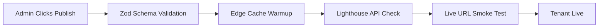

# Production Readiness & Launch Architecture

## 1. Production Readiness Framework
- **Gates**: Pre-flight checks, E2E validation, Tenant configuration audit, Infrastructure health check.
- **Enforcement**: CI/CD (GitHub Actions) blocks merge to `main` if coverage/performance falls below thresholds.

## 2. Final System Audit Architecture
- **Tooling**: Playwright, Lighthouse CI, Zod, Sentry, Dependabot.
- **Pipeline**: Daily cron runs full system audit against 3 mock production tenants.

## 3. Launch Validation Workflow

## 4. Tenant Launch Checklist
- [ ] Zod `RestaurantConfigSchema` parsing passes.
- [ ] English (`en`) and Polish (`pl`) `LocalizedString` fields populated.
- [ ] All media URLs resolve HTTP 200.
- [ ] Custom domain assigned and CNAME propagated.

## 5. Infrastructure Readiness Checklist
- [ ] Vercel Edge Middleware enabled globally.
- [ ] Postgres connection pooling (PgBouncer) active.
- [ ] Redis (Upstash) rate limiting configured.
- [ ] BullMQ workers scaled and polling.

## 6. SEO Readiness Checklist
- [ ] `robots.txt` dynamically generated per tenant.
- [ ] `sitemap.xml` generates correctly with `hreflang` alternates.
- [ ] JSON-LD `Restaurant` schema validates via Google Rich Results API.
- [ ] OpenGraph images dynamically resolving via `/api/og`.

## 7. Accessibility Readiness Checklist
- [ ] Axe-core tests pass on all `ui` variants (0 violations).
- [ ] Focus traps functional on all modals (`Sheet`, `Dialog`).
- [ ] Color contrast ratios > 4.5:1 enforced by AI theme generator.
- [ ] Screen-reader only (`<VisuallyHidden>`) applied to icon buttons.

## 8. Performance Readiness Checklist
- [ ] LCP < 2.5s on mobile (3G throttling).
- [ ] CLS = 0.0 (Strict `next/image` sizing enforced).
- [ ] INP < 200ms (Heavy components lazy-loaded).
- [ ] Bundle size < 150kb (First Load JS).

## 9. Security Readiness Checklist
- [ ] Supabase RLS policies active and tested.
- [ ] `Content-Security-Policy` headers restrict inline scripts.
- [ ] Vercel Environment Variables encrypted (No dev `.env` leaked).
- [ ] CSRF tokens validated on all mutation endpoints.

## 10. CMS Readiness Checklist
- [ ] RBAC roles correctly block destructive actions for `Editor` role.
- [ ] `postMessage` preview iframe latency < 50ms.
- [ ] Media library S3 pre-signed URL generation secure.

## 11. AI Pipeline Readiness Checklist
- [ ] LangSmith/Helicone tracing active for OpenAI/Gemini.
- [ ] Token budgeting hard-stops active per tenant.
- [ ] Fallback static templates configured if LLMs hallucinate repeatedly.

## 12. Localization Readiness Checklist
- [ ] Fallback to `pl` logic functions if `en` is missing.
- [ ] Currency/Date formatters utilize native browser `Intl` APIs.
- [ ] Routing middleware successfully intercepts and redirects `/` -> `/pl`.

## 13. Analytics Readiness Checklist
- [ ] PostHog capturing client events with `tenantId`.
- [ ] Plausible proxying through `/api/track` to bypass AdBlockers.
- [ ] GDPR Banner toggling tracking state correctly.

## 14. Reservation System Readiness
- [ ] Prisma transaction locking prevents double-booking.
- [ ] Turnstile CAPTCHA intercepts headless bot submissions.
- [ ] Transactional emails (Resend) DKIM/SPF verified.

## 15. Media Optimization Verification
- [ ] S3 bucket CORS configured for Vercel Image Optimization.
- [ ] AI-generated `blurDataURL` payloads valid base64 strings.
- [ ] WebP/AVIF format negotiation active.

## 16. Runtime Validation Workflow
- Production RSC intercepts failed Zod validations, falls back to `ErrorBoundary` component, alerts Sentry, returns 500.

## 17. Deployment Verification Workflow
- Vercel checks `pnpm build`.
- Vitest unit tests run.
- Playwright E2E executes against Preview URL.
- Swap Preview -> Production.

## 18. Monitoring Readiness
- [ ] Sentry DSN active in Edge, Server, and Client contexts.
- [ ] Datadog/Logtail catching structured JSON logs.
- [ ] PagerDuty webhook configured for 5xx spikes.

## 19. Rollback Readiness
- Vercel Instant Rollback configured to revert to previous immutable deployment ID within 500ms.
- Supabase Point-in-Time Recovery enabled.

## 20. Backup Verification Workflow
- Daily automated script pulls Supabase `.sql` dump, encrypts, and sends to AWS Glacier.

## 21. Error Recovery Readiness
- Tenant ID not found -> Renders generic Platform 404.
- AI Pipeline crash -> Retries via BullMQ exponential backoff.

## 22. Smoke Testing Strategy
- **Post-Deploy**: Synthetic Datadog browser tests visit 3 tenants, add items to menu, and open booking modal every 5 minutes.

## 23. Lighthouse Verification Workflow
- `lhci autorun` integrated into GitHub actions. Fails build if Performance < 90 or SEO < 100.

## 24. Cross-Browser Validation
- Playwright tests run concurrently on Chromium, WebKit, and Firefox in CI.

## 25. Mobile Readiness Verification
- CSS clamp values and `flex-col` variants tested via Playwright mobile viewports (iPhone 12 / Pixel 5).

## 26. Domain/DNS Verification
- Vercel Domains API script verifies CNAME records before toggling tenant `isLive` status.

## 27. SSL Verification Workflow
- Let's Encrypt certificates provisioned automatically via Vercel Edge Network upon domain addition.

## 28. Content QA Workflow
- AI generates content -> `WAITING_APPROVAL` status -> Human reviews in CMS -> Human clicks Publish.

## 29. Automation Readiness Verification
- Daily cron verifies OpenAI API keys are valid and under quota limits.

## 30. Final Launch Orchestration
1. **Freeze**: Code freeze on `main`.
2. **Migrate**: Run Prisma migrations on Production.
3. **Deploy**: Trigger Vercel Production Build.
4. **Warmup**: Hit Vercel Edge Cache with synthetic traffic.
5. **Verify**: Check Sentry for 0 baseline errors.
6. **Launch**: Route traffic to new system.
