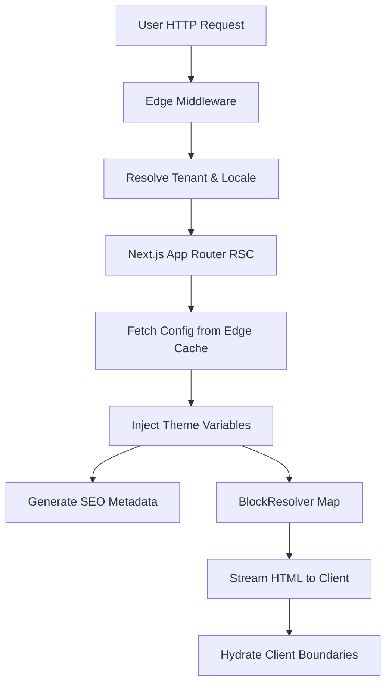

# Runtime System Integration Architecture

## 1. Runtime Assembly Architecture
- **Layer 1: Edge**: Cloudflare/Vercel (WAF, DNS, CDN).
- **Layer 2: Middleware**: Tenant resolution, Locale detection, Security headers.
- **Layer 3: RSC Root Layout**: Theme injection, global providers, metadata.
- **Layer 4: Server Component**: Config fetch, JSON validation, schema parsing.
- **Layer 5: BlockResolver**: Dynamic import of variant UI components.
- **Layer 6: Client Components**: Framer Motion orchestration, interactive forms.

## 2. End-to-End Rendering Flow


## 3. Full Request Lifecycle
1. Request -> Edge WAF checks Turnstile/Rate limit.
2. Edge Middleware identifies hostname (`bistrowarszawa.pl`).
3. Rewrites URL -> `/pl/bistro-warszawa/page`.
4. RSC fetches `config` (ISR cached).
5. RSC renders `<ThemeInjector>`, `<Header>`, `<BlockResolver>`, `<Footer>`.

## 4. Tenant Resolution Flow
```typescript
const host = req.headers.get("host");
const tenantId = await edgeRedis.get(`host:${host}`);
if (!tenantId) return new Response("Tenant Not Found", { status: 404 });
```

## 5. Dynamic Config Loading
- Cached infinitely via `fetch(url, { next: { tags: [`tenant-${tenantId}`] } })`.
- Zod parses payload. Failed parses trigger `ErrorBoundary`, return 500, alert Sentry.

## 6. Theme Injection Flow
- `ThemeTokens` extracted from config.
- RSC renders `<style id="theme-vars">` generating CSS custom properties (`--primary`, `--radius`, `--font-body`).

## 7. BlockResolver Execution Flow
```tsx
export function BlockResolver({ blocks, lang }) {
  return blocks.map(block => {
    switch (block.type) {
      case "HERO": return <HeroResolver data={block} lang={lang} />;
      case "MENU": return <MenuResolver data={block} lang={lang} />;
      // Dynamic imports resolve the variant lazily
    }
  });
}
```

## 8. Motion System Integration
- `ThemeTokens` includes `motionProfile` (`"snappy-modern"`).
- Client component `MotionConfigProvider` maps profile to Framer Motion spring physics.
- All children use `useMotion()` hook for variant definitions.

## 9. CMS Integration Flow
- Admin updates Zod schema via Visual Builder.
- Submits draft to `api/admin/publish`.
- Postgres saves `ConfigRevision`.
- Webhook fires `revalidateTag(tenantId)`.

## 10. Backend Integration Flow
- Client forms hit `/api/booking`.
- Server Action executes Zod validation.
- Writes to Supabase Postgres (via Prisma).
- Triggers Resend email + QStash background job.

## 11. SEO Integration Flow
- `generateMetadata()` reads config payload.
- Injects localized Title, Description, OpenGraph `/api/og`.
- Injects JSON-LD structured data into `<head>`.

## 12. Localization Integration Flow
- URL `[lang]` param cascades through RSC.
- Utility `t(stringObj, lang)` resolves `{ en: "Menu", pl: "Menu" }` at render time.

## 13. Analytics Integration Flow
- RSC injects PostHog provider.
- Edge Middleware attaches `tenantId` to all tracked events.
- Client intersection observers track scroll depth silently.

## 14. Security Middleware Flow
- Applies `Content-Security-Policy`.
- Validates Supabase JWTs for `/admin` routes.
- Redis sliding-window rate limit checks IP.

## 15. Reservation System Flow
1. `<BookingForm>` (Client Boundary).
2. Action -> `submitReservation()`.
3. Prisma -> Locks time slot, writes row.
4. Returns Success -> Hydrates Toast.

## 16. Media Rendering Pipeline
- DB stores raw S3 URL.
- RSC passes to `next/image` (`<MediaRenderer>`).
- Vercel optimizes to WebP. Base64 `blurHash` provides instant placeholder.

## 17. Asset Delivery Flow
- Cloudflare CDN caches static assets (fonts, CSS, JS) at edge (`s-maxage=31536000`).

## 18. Hydration Architecture
- Strict separation: Hero/Header hydrate instantly.
- Footer, Modals, Heavy carousels wrapped in `<Suspense>` to lower INP.

## 19. RSC / Client Boundary Architecture
- RSC: Fetching, Routing, Theme Parsing, Metadata.
- Client: Forms, Framer Motion, Intersection Observers, Dialogs.

## 20. ISR / SSR / SSG Integration
- **SSG**: Marketing/platform pages.
- **ISR**: Tenant pages (cached, revalidated on demand).
- **SSR**: Booking confirmation URLs (uncacheable).

## 21. Error Boundary Hierarchy
- `<RootErrorBoundary>`: Network failures, 404s.
- `<TenantErrorBoundary>`: Tenant DB resolution failures.
- `<BlockErrorBoundary>`: Single component crash (e.g., corrupt Menu JSON) isolates failure without breaking page.

## 22. Fallback Rendering Strategy
- If `config.media.url` is broken -> `<FallbackImage />`.
- If `motionProfile` invalid -> Fallback to `reduced-motion`.

## 23. Runtime Caching Architecture
- Upstash Redis (Edge): URL routing.
- Vercel Data Cache: Tenant JSON payloads.
- Cloudflare: Images, Static chunks.

## 24. AI-Generated Tenant Runtime Flow
1. AI outputs JSON string.
2. Background Job parses Zod schema.
3. Job sets `activeConfigId`.
4. Job revalidates cache. Next user request hits updated site instantly.

## 25. Deployment / Runtime Synchronization
- PR merges to `main`.
- Prisma applies DB migrations.
- Vercel deploys immutable build. Edge network shifts traffic.

## 26. Runtime Observability
- Sentry captures boundary errors tagged with `tenantId`.
- WebVitalsReporter pushes core metrics to PostHog.

## 27. Runtime Recovery Strategy
- Critical DB failover -> Supabase multi-AZ fallback.
- Cache corruption -> Auto-heals on next ISR tick or manual `/api/purge`.

## 28. Runtime Scalability Architecture
- Connection pooling via PgBouncer prevents Prisma edge exhaustion.
- Serverless architecture dynamically scales to handle traffic spikes.

## 29. Final Production Topology
- **DNS**: Cloudflare.
- **Hosting**: Vercel (Edge + Serverless).
- **DB**: Supabase (Postgres).
- **Cache**: Upstash (Redis).
- **Queue**: Inngest/QStash.

## 30. Complete System Orchestration
The entire factory operates asynchronously. AI pipelines generate raw material (JSON). Zod validates it. The database stores it. The Edge distributes it. The Next.js App Router (RSC) parses it. The `BlockResolver` maps it to UI components. Framer Motion animates it. PostHog tracks it. Sentry monitors it. Every step is highly isolated, decoupled, and typed.
